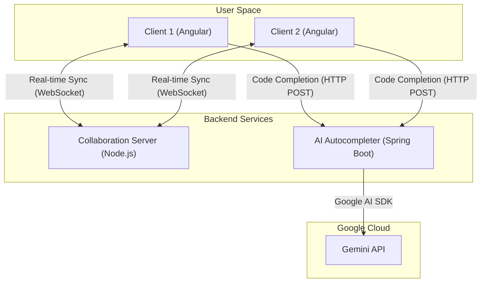

# Real-time Collaborative Code Editor (Angular/Yjs + Node.js/Websocket + Spring Boot/Gemini)

This is a project for a real-time collaborative code editor built with Angular, CodeMirror 6, and Yjs. It features a live collaboration server (Node.js) and an AI code completion service powered by the Gemini API.

# Architecture Overview

The system is designed as a decoupled frontend and backend, with collaboration and AI logic handled by two separate services.

    Frontend (Angular): A standalone Angular application (/frontend) that hosts a CodeMirror 6 editor.

        CollaborationService: Manages the Yjs document (Y.Doc), UndoManager, and the WebSocket connection to the collaboration server.

        AiCompletionService: Manages HTTP requests for AI code completion to the Spring Boot backend.

        EditorComponent: Orchestrates the services, binds them to the CodeMirror EditorView, and handles UI logic.

    Backend (Two Components):

        1. Collaboration Server (Node.js + y-websocket):

            Located in /backend.

            A minimal Node.js server running on ws://localhost:1234.

            Uses WebSockets to synchronize the Yjs document (CRDT data) between all clients connected to the same "room".

            Manages and broadcasts user "awareness" (cursors).

        2. AI Autocompleter Service (Spring Boot):

            Located in /code-edtior-autocompleter.

            A Spring Boot application that provides intelligent code completion suggestions powered by Google's Gemini API.

            Exposes a single endpoint: POST /api/complete.

            Securely handles the Gemini API key, preventing its exposure to the frontend.

# Communication Flow



# Getting Started

To get the collaborative code editor up and running, follow these steps:

## Prerequisites

Before you begin, ensure you have the following installed:

*   **Java 21**
*   **Node.js** (v18 or higher)
*   A **Google Gemini API Key**

## 1. Configure Environment Variables

The AI Autocompleter service requires your Gemini API key. You can also optionally specify the Gemini model to use.

Set these environment variables in your terminal session:

```bash
export GEMINI_API_KEY="YOUR_API_KEY" # Replace with your actual Gemini API Key
# export GEMINI_MODEL="gemini-2.5-pro" # Optional: Uncomment and set to use a different model (defaults to gemini-2.5-flash)
```

## 2. Install Dependencies and Run All Services

From the **root directory** of the project, execute the following commands. This will install necessary Node.js dependencies (including `concurrently` for running multiple processes) and then launch all three applications simultaneously.

```bash
# Install root-level Node.js dependencies (including 'concurrently')
npm install

# Run all services: Frontend, Node.js Collaboration Server, and Spring Boot AI Service
npm start
```

### What to Expect:

Upon successful execution of `npm start`, the following services will be running:

*   **Node.js Collaboration Server:** Accessible via WebSocket at `ws://localhost:1234`.
*   **Spring Boot AI Autocompleter Service:** Accessible via HTTP at `http://localhost:8080`.
*   **Angular Frontend:** Will automatically open in your default browser at `http://localhost:4200`.

You are now ready to use the collaborative code editor!

# How to Test

    1. Real-time Collaboration (Yjs)

        This feature is fully functional.

        Open your browser to http://localhost:4200/?room=project-A.

        Open a second browser tab (or an incognito window) and navigate to the same URL: http://localhost:4200/?room=project-A.

        Type in one editor. The text (and your cursor) will appear in real-time in the other window.

    2. AI Code Completion

        This feature is now connected to the live AI backend.

        In the editor, type a few letters (e.g., cons).

        Press the custom hotkey: Ctrl + . (Control + Dot).

        A completion menu will appear with suggestions from the Gemini API.

# Project Details

    ## Gemini API Key Configuration

        The `GEMINI_API_KEY` is used by the Spring Boot application. It is read from the environment variable you set in the "Getting Started" section. The key is never exposed to the frontend.

        You can also specify the Gemini model to use by setting the `GEMINI_MODEL` environment variable. If not set, the service will default to `gemini-2.5-flash` as configured in `application.properties`.

    ## Prompt Engineering & Response Parsing

        Prompt (Request): When the hotkey is pressed, the frontend sends a POST request to /api/complete with a JSON payload containing the fullText of the document, the cursorPosition, and the textBeforeCursor.

        Response Parsing: The Spring Boot service receives this request, constructs a detailed prompt for the Gemini API, and parses the response. It returns a JSON object in the format { "suggestions": [{ "label": "...", "type": "..." }] }. The frontend then maps this into the format required by CodeMirror's autocomplete extension.

    ## Assumptions & Simplifications

        No Persistence: The y-websocket server stores all documents in memory. If the Node.js server restarts, all data is lost.

        No Auth: Sessions are public and segmented only by the URL query parameter (?room=...).

        Basic Awareness: Cursors are synchronized, but additional user metadata (like names or custom colors) is not yet implemented.

    ## Potential Next Steps

        Activate Real AI in Frontend: The AiCompletionService in Angular needs to be updated to call the live backend at http://localhost:8080/api/complete instead of returning mock data.

        Add Persistence: Integrate a persistent Yjs provider (like y-leveldb or y-mongodb) into the y-websocket server to save document states.

        Enhance Awareness: Use provider.awareness.setLocalStateField on the frontend to add user names and colors, and display this information in the UI.

        Refine Completions: Improve the from: logic in the customAiCompletion function to replace text from the beginning of the current word, not just from the cursor position.